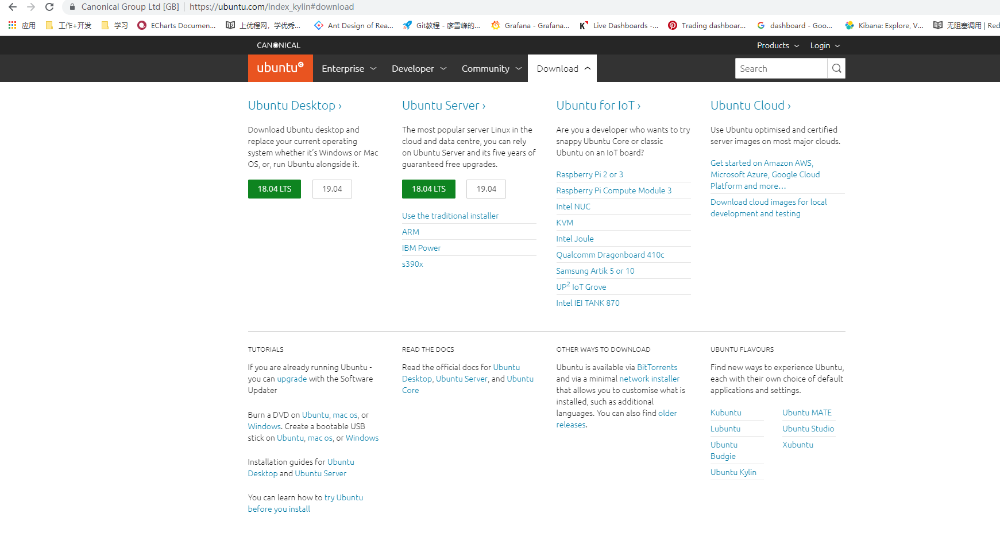
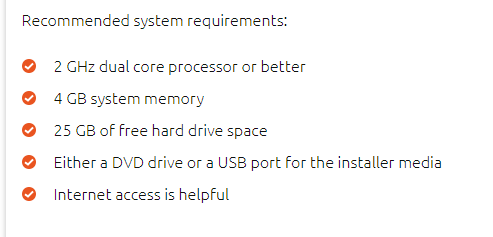

# linux操作系统入门, js相关知识整理
linux基础操作
es5
es6
js与qa工程师
函数式编程
js语言精髓

# 1. linux 操作系统介绍

  ## 1.1 历史
  * 1991年
  * 服务器, 计算器, 游戏机, 商用系统
  * 界面风格多变, 多种发行版
  * 驱动程序定制化
  * 终端-文本界面比window强大
  * 系统构造简单且稳定

  ## 1.2 选择发行版
  * ubuntu, redhat, centos, debain, fedora, suse等
  * [linux官网](https://www.linux.org); 开源社区, 可在此下载linux. ubuntu(桌面)及centOS较多。kali(网络安全/黑客), centOS/redhat(服务器)
  * [linux内核官网](https://www.kernel.org); 下载为内核代码。
  * [centOS官网](https://www.centos.org); 下载镜像DVD(图形界面), everything(dvd+所有软件), minimal(不提供图形界面=常用命令行操作,服务器操作); 可理解为红帽开源版
  * [redhat官网](https://www.redhat.com/zh), 商业型操作系统;
  * [ubuntu官网](https://www.ubuntu.com/index_kylin), 有中文官方网站, 常用desktop - LTS长期支持版本

  ## 1.3 虚机中安装
  * VM, 在window虚拟出多个计算机, VMware(商业), VirtualBox(开源) 和 VirtualPC(不开源但免费), 模拟计算机系统;
  * 推荐使用VMware, 下载地址官网[VMware](http://www.vmware.com/cn.html), 下载产品版本: workstation Pro; mac机下载Fusion;
  * 虚拟机2G内存即可, 25G剩余空间

# 2. linux和虚拟机的安装

  * 进入[ubuntu官网](https://www.ubuntu.com/index_kylin); 选择download desktop。下载镜像包至本地
  
  
  * 下载VMware虚拟机, 官网地址[VMware](http://www.vmware.com/cn.html); => 下载(for window)workstation Pro或(for mac)Fusion, 可能需要登录, 按要求进行新用户注册，然后继续进行下载即可。
  * > 下载安装完成后, 打开VMware, 输入密钥(购买)/试用30天后，进入软件界面: 新建(典型)虚拟机 => 下一步 => 安装来源(安装程序光盘 <下载的ubuntu镜像位置) -=> 下一步 => 输入个性化的名字/密码 => 下一步 => 虚拟机名称+位置(安装位置可修改至非c盘) => 下一步 => 将虚拟磁盘存储为单个文件 => 下一步 => 自定义硬件: 内存 > 2G; 处理器：每个处理器的核心数量2;  => 完成 => 虚拟机进行自动安装及启动。

# 3. linux的基本操作命令
  * 桌面程序 找到terminal程序, linux终端的命令行。
  ********* 
    linux基础操作: ls, cd, cp, rm;
    当前用户的目录内容: ls 或 dir
    ls -l :长格式目录, 展示更多详情: 访问权限-文件数量-目录所属用户-文件大小-创建时间-文件名
    ls -a : 展示所有(包含隐藏)目录, 隐藏目录文件以.开头。(当前.    上一级目录..)
    cd: cd + 文件名, 即可切换进入改文件内。文件名严格区分大小写。cd .. 退回上一级
    mkdir newFile: 在当前创建目录newFile, 同一级不可出现同名的文件。
    cp originFile aaa/bbb : 复制文件originFile到aaa文件下并命名为bbb;
    cp -R originFile targetFile: 复制目录aaa,复制成为名为targetFile的文件;
    pwd : 显示当前目录的全部路径
    rm targetName: 删除文件命令, 删除当前目录的targetName文件
    rm -r targetFile: 删除目录命令, 删除当前路径下的targetFile文件
  ************

# 4. windows命令行

  * 开始右击 运行 或者 win + R =>输入 cmd 回车进入windows命令行
  * dir, cd, md, copy, del, rename
  **************
    dir 当前目录内容： 时间 - 目录(dir)/文件(文件大小B) - 名字
    cd targetName : 进入当前目录下targetName目录内.    cd.. 返回上一级
    md aaa: 当前目录下创建aaa目录
    copy originFile aaa: 将指定文件originFile复制到指定aaa文件内;
    del targetName: 删除指定的文件, 删除的文件不会存在于回收站。
    rename target newName: 将当前目录下target文件名字改为newName;
  ***************

# 5. Cygwin安装及使用
  * window平台下的模拟环境; [Cygwin官网地址](www.cygwin.com), 
  ********
    安装, 按照向导下一步即可。userURL最好选择第一个最快。
    下载后, 选择View Full, 进行完全安装。直到安装程序完成。
    安装完成后, 即可在程序中找到cygwin terminal 64找到并进行使用, 窗口中，可以右击option 选择text选择字体，调整视觉效果。
  ********

# 6. linux的安装于基本命令
  * centOS的安装, 略。与以上Ubuntu的安装类似;
  * VIM: linux系统内集成极为经典的文本编辑器; 
  ************

    cd / : 进入用户的根目录
    cd ~ : 进入当前用户的区域目录
    pwd: 查看当前目录路径
    clear: 清除命令
    ls -al: 查看目录结构(a: 显示隐藏文件, l显示长列表格式)
    mkdir: 新建文件夹; 
    touch: 新建文件;
    rmdir: 删除文件夹;
    mv: 移动文件
    rm -rf: 删除所有内容(r递归, f强制)
    rm: 删除文件
    vi fileName: 进入文件
    :wq :退出文件
    startx或者init 5; 0 关机, 1: 单用户, 2.多用户状态无网络, 3.多用户状态有网络, 4. 系统未使用保留给用户, 5. 图形界面, 6. 系统重启 
  ************

# 7. web服务器基础原理
  * 客户 => 浏览器路径 => 服务器资源(最近的最没有压力的机器 - 负载) => 资源响应/分发 => 返回客户

  ********
    本机 localhost, 127.0.0.1;
    安装服务器IIS, Apache; 利用xampp集成软件包配置服务器; [xampp下载地址](https://www.apachefriends.org/index.html);
    xampp: 安装步骤也可参考博客地址https://blog.csdn.net/qing666888/article/details/81914389 进行学习配置;
    IIS： windows控制面板 => 打开或关闭windows功能 => internet信息服务 所有勾选 => 确认 即可在管理工具 => internet信息管理服务IIS 进行使用
  ********

# 8. es5新增语法
  * es5 简介 及 严格模式(use strict), 
  * 浏览器支持： 5大浏览器 + 移动端现可放心使用; es5-shim可用于兼容。
  *********
    'use strict'; 详细内容见./es5/strict.js
    json格式: JSON对象, 内容详见./es5/json.js
    添加对象, 内容详见./es5/object.js
    数组的补充, 内容详见./es5/array.js
    函数bind, this, 作用域, 闭包, 值传递/引用传递 内容详见./function.js
  *********

# 9. ECMAScript6详解;
  * 详细可参考es6.ruanyifeng.com;
  * 计划每年发布一个版本. 兼容性+处理方法。script引入; npm安装traceur进行转化; babel转码。
  * bable转码: babel example.js --out-file compiled.js / babel src --out-dir lib / babel src -d lib -s;
  * 了解shim, polyfill
  *******
    相关内容详见./es6
    额外的:
      * 对class的继续学习参考./es6/class;
      * promise+generator+async参考./es6/promise;
      * 对装饰器学习参考decorator.js;
      * 对this, bind, call, applay的使用参考thisClass.js
  *******

# 10. js与QA工程师
请查看[QA工程师](https://github.com/shuyancang/linux_js/blob/master/qa.md)

# 11. 函数式编程
请查看[函数式编程md](https://github.com/shuyancang/linux_js/blob/master/functionalProgram.md)

# 12. js语言精髓
请查看[js语言精髓](https://github.com/shuyancang/linux_js/blob/master/jsPith.md)

# 13. es6在企业中的运用
可查看[es6实战在企业中的运用](https://github.com/shuyancang/linux_js/blob/master/es6.md)

# 14. ts小课堂
查看[ts基础课程](https://github.com/shuyancang/linux_js/blob/master/ts.md)
