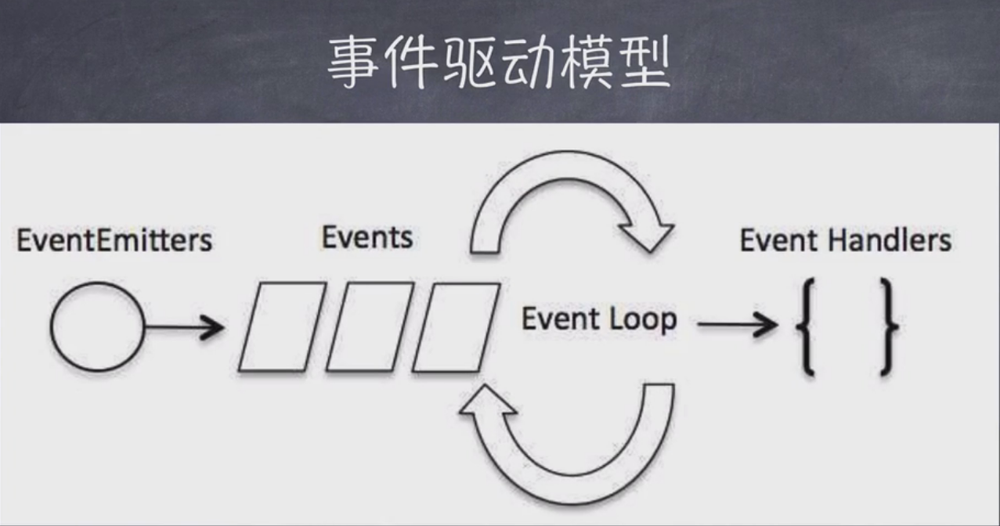
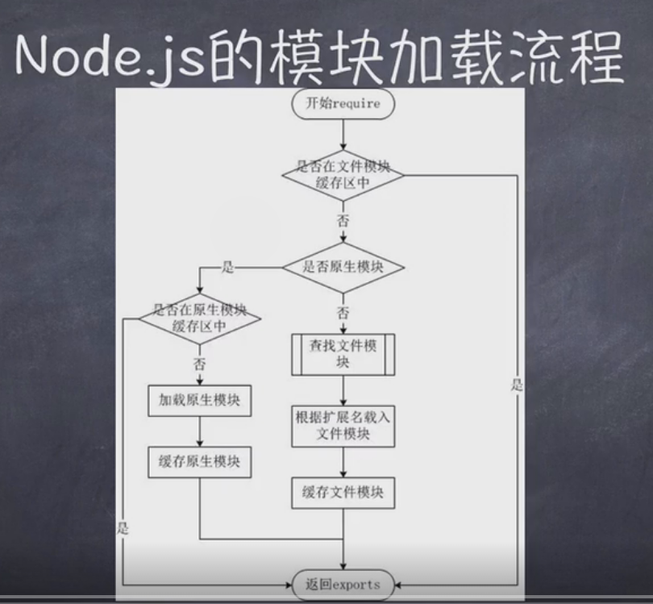

# nodeLensson
前端nodejs游

# 1. 认识nodejs
* 对nodejs的基础了解
***********************
  nodejs本质是js解析器; 是js运行环境, 是服务器程序不是web服务器, 使用的是v8引擎。
  nodejs可以使用js脱离浏览器环境, 并不是用于取代后台语言;
  nodejs最初是为了提供高性能web服务, 其io性能强大, 事件处理机制完善, 天然能够处理dom;
  nodejs优势: 处理大流量数据, 适合实时交互应用, 完美支持对象数据库(mongdb等), 异步处理大量并发连接;
***********************
* nodejs学习的前置知识: js, es6, 服务器基本知识, linux环境;
* nodejs相关资料和资源: 
[node官网](https://nodejs.org) => 安装, 文档, api文档, 及相关知识的学习手册
[nodejs中文网](https://nodejs.cn) => 中文版, 同上。
[github搜索](https://github.com)

# 2. nodejs基础使用
* nodejs安装, [node下载地址](https://nodejs.org/en/download/)进行下载及安装; 命令行内输入node -v可查看安装的node的版本号。
********************
node -v 查看安装的node版本;
node 进入node环境
ctrl c 两次或者 .exit退出node环境
********************
* npm: 安装nodejs时同时安装的。允许用户从npm服务下载别人编写的的第三方包;可以下载并安装别人编写的命令行程序;或供别人使用npm服务。
* [npm官方网站](https://www.npmjs.com), 可在文档入口查看npm的相关细节功能, 或进入[npm中国镜像](npm.taobao.org);
* cnpm全局安装, 命令行执行npm install -g cnpm --registry=https://registry.npm.taobao.org; 即可启用cnpm指令;
* 命令行执行node nodeFile.js;
* 使用nodejs原生http模块创建基础服务(listen端口, response设置header等); 代码可查看./src/node/server.js;

# 3. node环境及npm深入
* nodejs REPL环境: 交互式解释器; 在命令行执行node即可进入。
 **********
  环境内，可以执行语句计算1+2, 变量申明const x = 12;
  ctrl + c退出当前终端; ctrl + c两次退出repl环境; ctrl + d退出nrepl
  向上/向下键 查看输入的历史命令
  tab键 列出当前可使用命令(con => const, constuctor)
  .help 列出使用命令
  .break 退出多行表达式
  .clear 退出多行表达式
  .save filename 保存当前repl会话到指定文件
  .load filename 载入指定文件值repl
 **********
* npm深入
*******************
1. npm -v查看当前npm版本; 
2. npm install npm -g; // npm 升级(-g全局)
3. npm安装express细则: npm install express -g; => 全局安装express包
4. 卸载npm uninstall express -g; => 卸载express包
5. npm search express; // 查找express包,及在express之上拓展的包
6. npm help; // npm命令列表 npm help install => 解释install指令。q => 退出install指令的解释(新版本的npm help会直接弹出浏览器, q指令不再需要)。
*******************
# 4. nodejs回调函数
* 函数调用三种方式: 同步调用, 回调, 异步调用 => 回调是一种双向调用模式, 可以通过回调函数来实现回调;
* 阻塞与非阻塞: 关注的是程序在等待调用结果时的状态。
* 代码可参考./src/node/callback.js

# 5. 事件驱动机制 
* 事件驱动模型 ;
  **********
    event loop检查事件, 无事件休眠, 有事件执行;
    事件处理在单线程上达到了类似多线程处理的效果;
    流程 引入events对象 => 创建eventsEmitter对象 => 绑定事件处理函数 => 触发事件, 调用事件处理函数。
  **********
* 代码可参考./src/node/events.js

# 6. nodejs模块化
* 模块是node应用的基本组成部分 文件和模块一一对应, 一个文件就是一个模块;
* nodejs存在4类模块: 原生模块 + 3种文件模块;
* 缓存: 防止模块反复加载，提高加载速度。
* nodeJs的模块加载机制: 从文件模块缓存中加载, 从原生模块加载, 从文件加载
* require方法加载模块: 
************************
1. http, fs, path等原生模块中加载
2. ./mod或../mod, 相对路径文件模块加载
3. /path/mod, 绝对路径文件模块
4. mod, 非原生模块的文件模块
************************
* ; 
* 代码可参考./src/node/module.js

# 7. nodejs函数
* js中, 函数可以作为另一个函数的参数;
* 可以先定义一个函数, 然后传递; 也可以在传递参数的地方直接定义(匿名)函数; nodejs函数使用与javascript几乎相同
* 代码可参考./src/node/fun.js

# 8. nodejs 路由
* 一个域名下多个可访问的地址。根据url及get/post来执行响应的代码。
* http服务得到的数都会包含在request对象中, 可以将其分解为url和querystring两个模块进行解析。
* GET及POST请求。get请求参数在请求路径中为默认的请求方式, post不在路径中携带参数, post在nodejs中默认不会解析请求体(可以传输大量信息),需要时手动处理 
* 可以使用util工具函数, 处理路径; util是一个nodejs提供的核心模块, 提供了较多的便捷工具方法.
* 相关代码可查看./src/node/router.js;
* 
# 9. nodejs的全局对象及工具
* 全局对象global; nodejs可以直接访问global属性，而不需要在应用中包含。nodejs不可能在最外层定义变量, 因为任意文件都是模块。
* __filename: 正在执行的脚本的文件名, 将输出文件所在的绝对路径。
* __dirname: 当前执行脚本所在目录.
* setTimeout, clearTimeout, setInterval, clearInterval, console: 同javaScript
* process: 用于描述当前nodejs的进程状态, 提供了一个与操作系统的简单接口。exit, beforeExit, uncaughtException, Signal
* 详细的全局对象可参看[全局对象](https://www.runoob.com/nodejs/nodejs-global-object.html);
* nodejs常用工具utils, inspect任意对象转换为字符串, isArray是否数组等。还可以underscore进一步引入更加丰富的方法。

# 10. nodejs的文件系统。
* fs: node文件系统,中文文档可[参考](www.runoob.com/nodejs/nodejs-fs.html); 有同步与异步处理两种方式。
* 相关基础代码可参考./src/node/fs.js;
* readFile 读取文件
* open(path, flag[, mode], callback) 打开文件
* stat(path, callback) 获取文件信息
* fs.writeFile(file, data[, options], callback) 写入文件
* fs.read(fd, buffer, offset, length, position, callback) 读取文件
* fs.close(fd, callback) 关闭文件
* fs.ftruncate(fd, len, callback) 截取文件
* fs.unlink(path, callback) 删除文件
* fs.mkdir(path[, options], callback) 创建目录
* fs.readdir(path, callback) 读取目录
* fs.rmdir(path, callback) 删除目录

# 11. express入门
* express简洁灵活的nodejsWeb应用框架, 可快速搭建一个完整功能网站
* -可设置中间件响应http ; -定义了路由执行不同的请求; - 可以通过模板传递参数动态渲染html页面。
* npm install express  --save 安装express框架(根据package.json可以随时安装依赖npm i即可)
* --save上线需用, 会写入package.json的dependencies中; -dev开发中依赖包, 会写入package.json的devDependencies中
* 与express一起安装的重要模块: body-parser(数据处理); cookie-parsre(cookie解析); multer(处理表单数据);
* 可npm install supervisor -g 让nodejs的运行中程序自动获取到代码的变化。
* request请求对象与response响应对象;
* 简单了解restful的接口设计风格。get获取资源, post添加, put更新, delete删除,路径动态配置然后进行自动处理。
* 相关代码可查看./src/expressLesson;
# 11.1 express的中间件(middleware)使用
* 中间件是一个可以访问req, res的函数(next变量);
* 中间件功能: 执行代码, 修改请求和响应对象, 终结请求-响应循环, 调用堆栈中的下一个中间件
******************* 
1. 应用级中间件: 绑定到app对象上, app.use和app.METHOD
2. 路由级中间件: router = express.Router() 专门处理所有路由.
3. 错误处理中间件: (err, req, res, next) => {}四个参数处理错误。最常处理500, 404
4. 内置中间件：express.static(root, [options])唯一内置中间件, 负责express应用托管静态资源。
5. 第三方中间件: 第三方模块安装后app.use()引用即可。
******************* 
# 11.2 express路由
* 路由: 如何定义应用端点及如何响应客户端的请求app.METHOD(path, [callback...], callback)
* app.all()特殊的路由方法, 对一个路径上所有请求加载中间件,无http方法与之对应, 所有都会得到执行。
* 路由句柄: 可以为请求处理提供多个回调, 类似于中间件, 利用next()依次执行。
* app.get('/path', [callback0, callback1, callback2], (req, res)=>{...}) 函数数组和函数处理路由。
* res的响应方法概览: {download提示下载, end结束, json数据格式, jsonp, redirect重定向, render渲染}等
# 11.3 express的错误处理
* 诸如app.use((err, req, res, next) => { res.status(500).send('error 500')});
* 错误处理, 可以存储入错误日志, 方便记录与排查, 插件log4j.js可用于日志写入。
* 缺省错误处理句柄: 若不捕获错误, 该错误处理中间件将会被添加到中间件堆栈底部。
# 11.4 模板引擎
* 需要在应用中进行如下设置才能让express渲染模板文件:views-模板文件目录, view engine-模板引擎
* swig => 常用的js模板引擎(npm install swig --save);
* 
# 12. KOA入门
* koa-基于node的web开发框架; 利用async避免函数嵌套。koa不在内核方法中绑定任何中间件-轻量函数库
* [koa官网查看](https://koa.bootcss.com/), npm install koa进行安装;
* koa中间件使用async, 避免callback hell;
* koa级联, 中间件调用next()则函数暂停将控制传递给定义的下一中间件, 当下游无中间件时, 每个中间件执行其上游行为.
* koa基础api简介: 
********* 
1. app.env 环境,默认是 NODE_ENV 或 "development"
2. app.proxy 当真正的代理头字段将被信任时
3. app.subdomainOffset 对于要忽略的 .subdomains 偏移[2]
4. app.listen 应用不是1-1的http服务器, 一个或多个koa应用可以被挂载到一起组成http应用群
5. app.callback 返回使用于http.createServer()的回调来处理请求
6. app.use将给定的中间件方法添加到应用
7. app.keys设置签名的cookie密钥.
8. app.context从其创建的ctx原型,
********* 
* koa context上下文简介: 
*********
1. koa context将node的req和res对象封装到单个对象, 强制中间件通用
2. 每个请求都将创建一个context,在中间件作为接收器, 约定以ctx表示(ctx.response, ctx.request)。
3. ctx.cookies.get(name, [options]), options获取cookie
4. ctx.cookies.set(name, value, [options]), options设置cookie.
5. ctx.throw([status], [msg], [properties])错误抛出
6. ctx访问器与request等效别名: ctx.header, .url, .method, .path, .query等等。
7. ctx访问器与response等效别名: ctx.body, .status, .type等。
*********
* koa 请求 - request; 是对node的request对象的进一步抽象和封装, 提供日常http服务器开发的一些有用功能
*********
  1. header:请求头, method请求方法, length内容长度, url请求地址, originalUrl请求原始地址, path路径, 
  2. querystring查询字符串, query解析的查询字符串, ip远程地址, is(type)
  3. accepts(types), acceptsEncodings, acceptsCharsets, acceptsLanguages, 接收的类型判断。
*********
* koa 输出 - response, 对node的response对象的抽象和封装。
*************
1. header响应头, status响应状态, body响应体,  
2. get(field)获取res-header中字段, set(field, value)设置res-header字段
3. type类型, redirect重定向, 
*************
* [koajs-github官方examples](https://github.com/koajs/examples); 可以参考该地址源码进行学习与开发。
* [restful的koa开发demo](https://github.com/PatrickWolleb/generator-koa-rest); 小型开发结构demo
* yoeman项目脚手架的引入, 快速开发。=> 快速搭建属于自己的脚手架。

# 13. express实战
* 代码详见./express-app
* 基础分析:
***************
* npm install -g express-generator
* express express-app脚手架执行, 自动生成脚手架目录结构(npm i后即可使用)
* /bin 内部启动文件www; 直接在根目录执行npm start; /public 静态文件; /routes 路由系统; /views 模板文件;中间件, next传递
* 可以在npm搜索安装mysql --save插件直接进行数据库的操作, 具体操作可查看api
* npm中orm插件, 也可以较为便捷的对数据库进行操作。
***************

# 14. koa1实战
* koa, koa-router; koa创建项目, koa-router管理路由,
* 可以安装yoeman后进行脚手架安装再开发: npm install -g yo; npm install -g generator-koa; mkdir new-project && cd $_; yo koa;
* 了解第三方请求插件: request-promise

# 15. koa2实战(koajs.com)
* 代码可查看./koa2demo
* async 与 await的异步模式

# 16. 爬虫系统
* 爬虫是一种自动获取网页内容的程序, 是搜索引擎的重要组成部分. 搜索引擎优化很大程度上就是针对爬虫而做的优化
* robots.txt是一个文本文件, 是一个协议不是一个命令。 robots.txt是爬虫要查看的第一个文件, robots.txt文件告诉爬虫在服务器上什么文件是可以被查看的, 搜索机器人就会按照该文件中的内容来确定访问的范围
* 以node实现: 需要使用的模块 => express, request, cheerio, 代码实例可参考./spider

# 17. 数据推送
* 相关案例codes可查看./dataPush;
* http长链接: comet;-前端轮询实现或后台ob_flush, flush, while结合进行处理
* 基于websocket的推送方案: 
**************
1. 利用express直接创建目录 => npm i后 => npm i socket.io安装关键包
2. 前端引入socket.io.js, jquery.js, 创建基础chat.html页面
3. 前端文件内socket.on('open', callback) 保持监听socket.send(msg)发送给服务器消息
4. 前端socket.on('message', callback); 获取后台发送过来的msg
5. 后台socket.on('message, callback); 获取前端发送过来的信息
**************
* SSE服务器推送数据新方式(Server-Send Event)
*****************
* Event Source

*****************