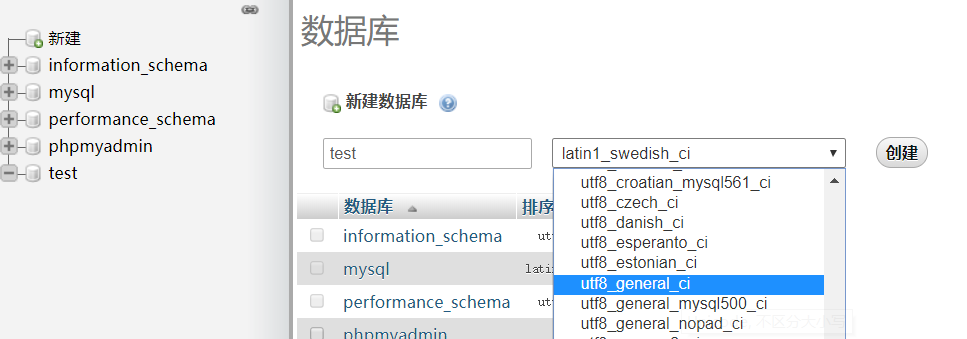

# yideng_php : php的基础学习

# 1. php

  * 开源脚本语言， 可以将php程序嵌入到HTML文档中去执行，主适用于web领域，还可以执行编译后代码-使得代码更快;
  * xampp安装后直接读取目录下index.php即可在浏览器中查看;
  * php初步: echo,嵌入html, if.else., 变量, 基础变量获取及作用域等, 参看./src/myphp/a.php + index.php;
  * php基础操作: require引用, arr, ajax向php发送请求并接收, 参看./src/myphp/b.php + bb.php;

# 2. mySQL

  * 数据库。数据库定义了存储信息的结构; mySQL: 关系型数据库, 数据保存在不同表 - 开源。
  * SQL语言 => 一般中小型网站使用都选择mySQL; LAMP(linux, apache, mysql, php)组合;
  * xampp开启后，开启Apache(start); 点击MySQL - start开启后, 继续点击Admin => 开启MySQL的管理页面
  * 新建数据库和表: 命名 + utf8_general_ci(格式); => 点击进入新建的数据库建表和字段
  * ;;
  * SELECT *; SELECT; INSET; UPDATE; DELETE 操作; 
    *****************
      INSERT 新增： 前面字段与后值，应一一对应;
      SELECT `*` FROM `news` WHERE  id=1; 查询, 查询字段条件id = 1; WHERE 1 => 符合字段名的所有。
      UPDATE 类似于INSERT; 设定字段对应的值, 后WHERE代表条件;
      DELETE; 删除 where依据某条件删除数据库信息。
    *****************
  * mysql的安装
  ************
  1. 下载MySQL数据库可以访问[官方网站](https://www.mysql.com/); 对应版本进行下载;
  2. 选择zip格式下载解压后, 配置环境变量path 指向程序的解压缩目录内的/bin/
  3. 在目录下创建ini文件, 文件配置见./mySQL/my.ini, basedir指向自己的文件夹 ,datadir指向一个新的数据库文件夹。
  4. 以管理员方式打开cmd命令行窗口, 在sql的bin目录下执行mysql的安装: mysqld -install
  5. mysql继续执行初始化: mysqld --initialize-insecure --user=mysql
  6. 执行mysql服务 net start mysql

  ************

# 3. php与mySQL 
  * 详细各种指令可查看[php文档](https://www.runoob.com/php/func-mysqli-query.html); 案例参考./src/myphp/sql.php;
  * mysqli_connect(servername, username, password); 链接数据库
  * mysqli_close($link);  关闭连接
  ********* 
    php的连接字符串：'a'.'b'.$con.'c';
    mysqli_query($con,"SELECT * FROM websites");
    mysqli_query($con,"INSERT INTO websites (name, url, alexa, country)
    VALUES ('百度','https://www.baidu.com/','4','CN')");
  ************

# 4. PHP PDO快速入门
  * [phpinfo](http://localhost/dashboard/phpinfo.php);
  ********
    PHP 数据对象 （PDO） 扩展为PHP访问数据库定义了一个轻量级的一致接口。
    PDO 提供了一个数据访问抽象层，这意味着，不管使用哪种数据库，都可以用相同的函数（方法）来查询和获取数据。
    简单了解即可; ./src/pdo/index.php;
  ********

# 5. PHP语言详解

## 5.1 面向对象

  * 软件危机 => 面向对象 <=> 软件工程学 => 面向对象 三个目标重用性, 灵活性, 扩展性; 特点: 封装, 继承, 多态;
  * 类(属性,方法) => 对象(标识, 行为)

  **********************
    class 类名{ [成员属性] [成员方法] } 
    class 类名 [extends 父类] [implements接口1[,接口2]] {[成员属性/变量] [成员方法/函数]}
    成员属性(修饰符 $变量名[=默认值])-不可以是带运算符的表达式,变量,方法或者函数调用: public $var=123;
    成员方法 function 方法名(参数){ [方法体] [return 返回值] }: public function say(){ echo "说话" }
    new生成实例化对象; $引用名 = new 类名(构造参数);
    $引用名 -> 成员属性 = 赋值; (对象属性赋值); //  echo $引用名 -> 成员属性;
    $引用名 -> 成员方法(参数); // 调用成员方法
    特殊对象的引用 this; 
    * 其余： 克隆对象clone，通用方法__toString(), __call()方法，自动加载类, 对象串行化(serialize, unserialize)
    * 其余方法: class_exists, get_class_methods, get_class, get_object_vars, get_parent_class, is_a, method_exist;
    * 其余-钩子函数: __sleep对象串行化时候完成睡前申请, __wakeup唤醒 => 钩子函数。
    * autoload, 自动加载类。实现类文件的自动加载。
    * 命名空间namespace; 
    可以查看基础class声明./src/myphp/oop.php;
  **********************
  
## 5.2 构造方法与析构

* 构造方法: [修饰符]function__construct([参数]){ ...程序体 }
* 析构方法: [修饰符]function__destruct([参数]){ ...程序体 }
* 实例查看./src/myphp/consDes.php;

## 5.3 面向对象封装性

* 私有成员, __set, __get, __isset, __unset;
* 访问修饰符: public公有(默认); private(私有的 => 不能在子类访问); protected(受保护的 => 子类可以访问)
* 实例查看./src/myphp/encapsulation.php;

## 5.4 继承与多态
* php只允许单继承(extends)。一个子类只能有一个父类，不能直接继承多个类。但一个类可以被多个类继承；可以有多层继承。
* 多态： 子类重载/重写(overwrite, overload)父类方法。 子类中使用parent访问父类中被覆盖的属性和方法 => parent::construct(); parent::fun();
* demo代码参考./src/myphp/extends.php;

## 5.5 抽象类和接口

* 抽象方法和抽象类： 类中没有方法体的方法, 直接分号结束，以abstract定义: public abstract function fun(); 
* 抽象类，包含抽象方法的类，也是用abstract声明;
  ******
    抽象类不能实例化(不能new成对象);
    使用抽象类, 必须定义一个类去继承这个抽象类,并定义覆盖父类的抽象方法。
  *********
* 接口技术: 制定了一个实现该接口的类必须实现的一系列函数
  ******************  
    定义格式 interface 接口名称{
      // 常量成员(const关键字定义)
      // 抽象方法(不需使用abstract关键字)
    }
    接口使用格式 class 类名 implements 接口1, 接口2{ ....... }
  ******************  
* 抽象类与接口的区别： 接口->动作的抽象,对类局部行为进行抽象, 抽象类->根源的抽象, 对一类事物的抽象描述。
  *************************
    1. 接口时抽象类的变体，接口中所有方法都是抽象的，而抽象类时声明方法的存在而不去实现他的类
    2. 接口可以多继承， 抽象类不行
    3. 接口定义方法，不能实现，而抽象类可以实现部分方法
    4. 接口中基本数据类型为static而抽象类不是
    5. 接口中不能含有静态代码块及静态方法，而抽象类中可以有。
  *************************
* 实例代码参考./src/myphp/interface.php;

## 5.6 了解常见关键字
* final: 修饰类和方法, 使用final关键字标识的类不能被继承被子类覆盖-最终版本,
* static: 静态，修饰类的属性方法。静态属性和方法不用实例化，可以直接使用类名访问。类方法中，使用self::引用静态变量和方法。静态属性是共享的
* 单例设计模式: 一个类只能有一个实例对象存在。
* const: 常量。类定义常量，不可修改。
* instanceof: 检测当前对象实例是否属于某个类的子类。

## 5.7 php的异常处理

* 系统自带的异常处理 class Exception{ ... }; message, code, file, ....
* 自定义异常处理
* 捕捉多个异常 try... catch... => catch可以捕获到Exception实例化的对象。getFile, getLine, getCode, getMessage;
* throw new Exception(.....); 当try内有多个throw时,可以使用多个catch分别(按顺序)捕捉，也可以使用一个catch统一捕获。
* php更多面向对象相关详细学习可[参考](www.cnblogs.com/xiaochaohuashengmi/archive/2010/09/10/1823042.html);

# 6 php与js的比较
* php与js实现类与继承。
* js的原型链: prototype, __proto__, constructor;
* 实例代码详见./src/demo/phpCompareJs.js;

# 7. mySQL数据客户端基础
* [mySQL官网](https://dev.mysql.com/); [workBench下载位置](https://dev.mysql.com/downloads/workbench/); 下载后安装即可。
## 7.1 mySQL的使用及安装教程：
  1. [mySQL下载地址](https://dev.mysql.com/downloads/mysql/), 选择第一个zip包(我是mysql-8.0.16-winx64); 下载后解压缩至自己的指定文件夹。
  2. 解压缩的第一级文件夹下(README同级), 创建my.ini文件, 用于初始化。文件内容见./src/mySQL/my.ini; 文件位置可以全局环境变量。
  3. 进入/bin, 启动命令行, 右键以管理员身份运行(否则安装会被拒绝) mysqld --install; 安装后会提示service successfully installed;
  4. /bin继续输入指令。/mysqld --initialize --console进行初始化,初始化后会在后面自动输出当前sql连接的初始密码，需要记录。
  5. /bin继续输入net start mysql; 成功提示mysql服务已经成功启动
  6. /bin命令行继续输入mysql -u root -p指令，进入mysql, 输入password及密码。 
  7. 初次进入后, alter user root@localhost identified by 'new password'; 即可完成新密码的修改;至此mySQL安装完毕。

## 7.2 mysql bench安装使用基础
* 安装完成后可进行添加数据连接。 点击mySQL Connections后面加号即可。对应Hostname, port, Username, Password等可进行设置。一般使用默认。
* 添加完成后, 在添加界面下方点击 test connection进行数据库连接测试。
* 软件界面有两个切换按钮: administrations 和 schemas
* administrations => 可以在内查看server status: 当前数据库的连接状态; users and privileges: 用户配置; 
* schemas => 右击创建新的schemas,常用数据库命名规则以db_开头，如db_news, db_info; 数据表开头以t_开头，t_messages等。collation一般选择utf8, default-collation;
* workbench中数据库名称在展示中文字是否黑体，黑体展示的数据库代表操作时候的默认数据库;可通过右击set as default schema将指定数据库作为默认。
* tables: 数据表： views: 视图; stored Procedures: 存储过程; Functions： 函数；
* 新建tables: dataType选择数据类型(int整形, varchart字符, datatime日期, char(1)定长字符), pk表示是否设为主键,  nn表示非空, ai表示自动增长;
* 创建后可以使用右击refresh all,刷新查看数据表; 
* sql语句简析: 
*********************************
1. SELECT * FROM db_test.t_student WHERE gender='M'; // 查询在db_test的t_student中查询所有gender=M的信息
2. SELECT count(*) FROM db_test.t_student WHERE gender='M'; // count(字段) => 满足where条件的数据条数;
3. SELECT min(birthdate) FROM db_test.t_student; // min(字段) => 求birthdate中的最小值; max最大值。
4. 常见函数first第一个, sum求和, sqrt平方根, rand随机数, now当前时间; 其余可参考[w3school的sql手册](www.w3school.com.cn/sql/index.asp);
5. concat拼接字符串 select concat(id,'--', name) from db_test.t_student
6. where birthdate >= '1991-01-01' and birthdate <= '1993-01-01'; 筛选时间大于/小于指定条件的数据(> < and)
7. where birthdate between '1990-01-01' and '1992-01-01'; 筛选时间在某个区间(between and 成对)
8. where name like '王%'; 筛选name中以王开头的数据; %为通配符代表任意字符; '%六%' => 带六的字符; '%六' => 六结尾的字符(like性能不佳,勿滥用)
9. sql中的注释 -- sql注释在此;双减号加一个空格, 复杂语句中常用。
*********************************

## 7.3 命令行操作管理数据库:
********************************* 
1. mysql -u root -p 账号密码登录sql
2. show databases; 展示当前数据库列表(指令必须带分号结尾，否则错误后，重新输入带分号的指令依然报错，需要exit推出后重新执行，或者在下一行只输入;相当于接着上一行继续执行)。(分号 - 管理语句不加分号可以执行，但sql语句不加分号，不能执行)
3. use db_test; 使用db_test作为使用的数据库。
4. tables: 数据表： views: 视图; stored Procedures: 存储过程; Functions： 函数；
5. 新建tables: dataType选择数据类型(int整形, varchart字符, datatime日期, char(1)定长字符), pk表示是否设为主键,  nn表示非空, ai表示自动增长;
6. 创建数据表语句: CREAT TABLE `db_test`.`t_student`( // db_test创建表所属的数据库,  t_student创建的表名
  `id` INT NOT NULL AUTO_INCREMENT COMMENT '', // 字段 + 数据类型(int, varchart, char, date), 非空, 自增, 注释
  `name` VARCHART(40) NOT NULL AUTO_INCREMENT COMMENT '',
  PRIMARY KEY(`id`) COMMENT ''); // 主键id
********************************* 

## 7.4 复杂条件查询:

*****************************
1. select * from db_test.t_student order by birthdate; order by orderName=> 排序orderName(默认正序, asc可省略); order by orderName desc => 倒序排序orderName
2. select * from t_student, t_class where t_student.class_id = t_class.class_id; 关联class_id查询两个表中的信息.
3. select t_student.id, t_student.name, t_class.class_name from ...// 满足条件的信息, 只要id, name, class_name字段。
4. select * from t_student left join t_class on where t_student.class_id = t_class.class_id; // join on语句，
*****************************

# 8. yii的安装与使用
**************
* 安装composer: [官网](https://getcomposer.org/download/)搜索下载, 下载composer-setup.exe, composer.phar
* 将composer.phar放入php目录(php需要提前安装及配置入环境变量path)
* php目录中新建composer.bat文件, 文件内容如: @ECHO OFF
 php "%~dp0composer.phar" %*
* 安装composer asset插件： composer global require "fxp/composer-asset-plugin:^1.2.0"
* 配置Composer中国镜像：composer config -g repo.packagist composer https://packagist.phpcomposer.com
* 安装yii2 advance版: composer create-project yiisoft/yii2-app-advanced advanced 2.0.10
* 安装后的目录内直接执行init.bat文件 => 选择开发环境初始化
* 安装后的advanced目录/common/config/main.php内写入配置'urlManager' => [      
    'enablePrettyUrl' => true,      
    'showScriptName' => false,      
    'rules'=>[ 
    	'<controller:\w+>/<action:\w+>'=>'<controller>/<action>',
    ],
], (这里我加了要报错~？)
* 下载伪[静态文件](https://pan.baidu.com/s/1sljeo0X?errno=0&errmsg=Auth%20Login%20Sucess&&bduss=&ssnerror=0&traceid=);解压后的文件放入/frontend/web和/backend/web下
* 在自己的安装目录下执行yii serve --docroot="frontend/web/"开启8080端口
**************
